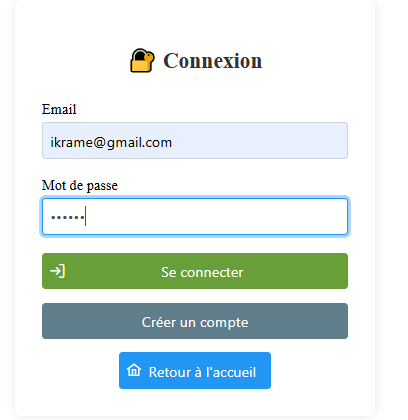

# Atelier 3: Application web basée sur JSF et JPA
Ce projet consiste en la réalisation d'une application web e-commerce complète en utilisant les technologies Java EE modernes. L'application simule le fonctionnement d'un site de vente en ligne permettant aux utilisateurs de consulter des produits, gérer un panier d'achat et passer des commandes.
Le projet met en pratique les concepts suivants :

* JPA (Java Persistence API) pour la persistance des données
* JSF (JavaServer Faces) pour l'interface utilisateur
* CDI (Contexts and Dependency Injection) pour l'injection de dépendances
* PrimeFaces pour enrichir l'interface graphique
* JTA (Java Transaction API) pour la gestion des transactions
## 

## Fonctionnalités

-   **Authentification Utilisateur :** Inscription et connexion sécurisées pour les clients (`Internaute`).
-   **Catalogue de Produits :** Parcourir les produits (`Produit`) organisés par catégories (`Categorie`).
-   **Panier d'Achat :** Ajouter, modifier et supprimer des articles d'un panier d'achat (`Panier`).
-   **Gestion des Commandes :** Passer des commandes (`Commande`) et consulter l'historique des commandes.
-   **Panneau d'Administration :** (Impliqué par `admin-commandes.xhtml`, `admin-produits.xhtml`) Fonctionnalités pour les administrateurs afin de gérer les produits et les commandes.
-   **Design Responsive :** Style de base avec `custom.css`.

## Technologies Utilisées

-   **Backend :**
    -   Java EE
    -   JSF (JavaServer Faces)
    -   CDI (Contexts and Dependency Injection)
    -   JPA (Java Persistence API) pour l'interaction avec la base de données (impliqué par `persistence.xml`)
-   **Frontend :**
    -   XHTML (pour les vues JSF)
    -   CSS (pour le style)
-   **Outil de Build :**
    -   Maven
-   **Serveur :**
    -   WildFly
## Diagramme de classes


## Structure du Projet

Le projet suit une structure standard Maven et d'application web Java EE, organisée comme suit :

-   `pom.xml` : Le fichier Project Object Model de Maven. Il définit les dépendances du projet (bibliothèques externes), les plugins de build, les informations du projet et le cycle de vie de la construction.
-   `src/main/java` : Ce répertoire contient tout le code source Java de l'application.
    -   `ma.fstt.beans` : Ce package regroupe les beans gérés par JSF (Managed Beans) et CDI. Ces classes agissent comme des contrôleurs pour les vues XHTML, gérant la logique métier et l'interaction avec les modèles de données.
        -   `AuthBean.java` : Gère l'authentification et l'enregistrement des utilisateurs.
        -   `CategorieBean.java` : Gère les opérations liées aux catégories de produits.
        -   `CommandeBean.java` : Gère la création, la consultation et le suivi des commandes.
        -   `PanierBean.java` : Gère la logique du panier d'achat (ajout, suppression, mise à jour des articles).
        -   `ProduitBean.java` : Gère les opérations CRUD (Créer, Lire, Mettre à jour, Supprimer) pour les produits.
    -   `ma.fstt.config` : Contient les classes de configuration spécifiques à l'application.
        -   `AdminAuthFilter.java` : Un filtre de servlet utilisé pour intercepter les requêtes et appliquer des règles d'authentification/autorisation, notamment pour les pages d'administration.
        -   `FacesCDIActive.java` : Une classe de configuration pour s'assurer que CDI est correctement activé et intégré avec JSF.
    -   `ma.fstt.model` : Ce package contient les classes d'entités JPA, qui représentent les tables de la base de données et définissent la structure des données de l'application.
        -   `Categorie.java` : Entité représentant une catégorie de produits.
        -   `Commande.java` : Entité représentant une commande passée par un internaute.
        -   `Internaute.java` : Entité représentant un utilisateur ou un client.
        -   `LigneCommande.java` : Entité représentant une ligne de commande (un produit spécifique dans une commande).
        -   `LignePanier.java` : Entité représentant un article dans le panier d'achat.
        -   `Panier.java` : Entité représentant le panier d'achat d'un internaute.
        -   `Produit.java` : Entité représentant un produit disponible à la vente.
-   `src/main/resources` : Ce répertoire contient les ressources non-Java nécessaires à l'application.
    -   `META-INF/beans.xml` : Fichier de descripteur CDI qui active CDI pour l'application.
    -   `META-INF/persistence.xml` : Fichier de configuration de l'unité de persistance JPA, définissant comment les entités sont mappées à la base de données et les propriétés de connexion.
-   `src/main/webapp` : Ce répertoire contient toutes les ressources web de l'application.
    -   Fichiers `.xhtml` : Ce sont les pages de vue de l'application, écrites en XHTML et utilisant la syntaxe JSF pour l'interface utilisateur.
        -   `index.xhtml` : La page d'accueil de l'application.
        -   `login.xhtml` : Page de connexion des utilisateurs.
        -   `register.xhtml` : Page d'enregistrement des nouveaux utilisateurs.
        -   `categories.xhtml` : Affiche la liste des catégories de produits.
        -   `admin-produits.xhtml` : Interface d'administration pour la gestion des produits.
        -   `admin-commandes.xhtml` : Interface d'administration pour la gestion des commandes.
        -   `panier.xhtml` : Affiche le contenu du panier d'achat.
        -   `commandes.xhtml` : Affiche l'historique des commandes de l'utilisateur.
        -   `confirmation.xhtml` : Page de confirmation après une action (par exemple, après avoir passé une commande).
    -   `resources/css/custom.css` : Fichier CSS personnalisé pour le style et la mise en page de l'application.
    -   `WEB-INF/faces-config.xml` : Fichier de configuration principal de JSF, utilisé pour enregistrer les navigateurs, les convertisseurs, les validateurs et définir les règles de navigation.
    -   `WEB-INF/web.xml` : Le descripteur de déploiement de l'application web. Il configure les servlets, les filtres, les listeners, les pages d'erreur et d'autres paramètres globaux de l'application web.

## Configuration et Installation

Pour configurer et exécuter ce projet localement, suivez ces étapes détaillées :

1.  **Prérequis :**
    *   **Java Development Kit (JDK) ** 
    *   **Apache Maven :** Version 3.6.x ou supérieure.
    *   **Serveur d'Applications Java EE :** WildFly.
    *   **Base de Données :** Une base de données relationnelle (MySQL).

2.  **Cloner le dépôt :**
    ```bash
    git clone https://github.com/IkrameHouzane/ATELIER3_JEE
    cd atelier3
    ```

3.  **Configurer la Base de Données et la Source de Données (Datasource) :**
    *   **Création de la Base de Données :** Créez une base de données vide sur votre serveur de base de données (par exemple, `atelier3_db`).
    *   **`persistence.xml` :** Ouvrez le fichier `src/main/resources/META-INF/persistence.xml`.
        *   Vérifiez le nom de l'unité de persistance (par exemple, `<persistence-unit name="primary">`).
        *   Utilisation d'une Datasource JNDI :
            Configurez une source de données (Datasource) sur votre serveur d'applications (moi je l'ai fait via la console d'administration de WildFly/GlassFish). Le `persistence.xml` devrait alors faire référence à cette datasource JNDI.
            Exemple dans `persistence.xml` :
            ```xml
            <jta-data-source>java:/MySqlDS</jta-data-source>
            ```
            Vous devrez configurer la source de données JNDI `java:/MySqlDS` sur votre serveur d'applications (WildFly) pour qu'elle pointe vers votre base de données. Le nom de l'unité de persistance dans mon projet est `mycnx`.

        

4.  **Construire le projet :**
    Ouvrez un terminal dans le répertoire racine du projet (`atelier3`) et exécutez la commande Maven :
    ```bash
    mvn clean install
    ```
    
5. **Déployer et Démarrer le Serveur :**
    Assurez-vous que votre serveur d'applications est démarré.

## Captures d'écran

Cette section présente des aperçus visuels de l'application:


       


